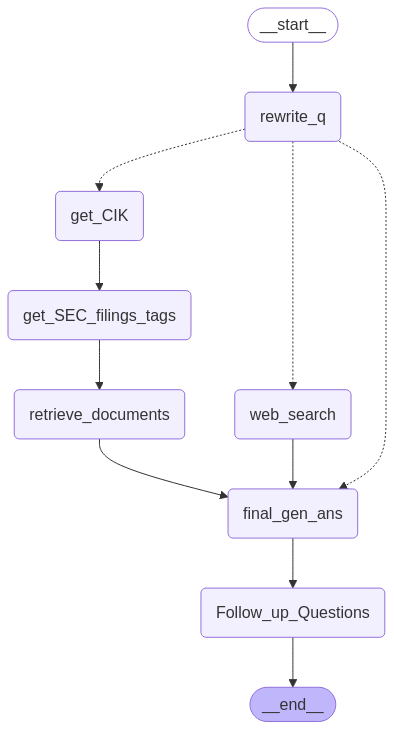

This project is an early prototype for a chatbot that utilizes a combination of **Large Language Models (LLM)** and **Retrieval-Augmented Generation (RAG)** to answer questions related to stock and finance topics, providing insights on company data and stock market trends. Additionally, it recommends related follow-up questions for deeper exploration.

## Project Overview

The chatbot leverages multiple services and APIs such as **AWS Bedrock**, **Tavily Client** (for web scraping), **Groq**, and **LangChain** to provide relevant and context-based answers to finance-related questions. It also uses SEC filing data and documents to enhance the answers further.

### Key Features:
- Answer questions related to stock markets and finance.
- Provides insights based on **SEC filings** and **web data**.
- Suggests follow-up questions.
- Integrates with various APIs and embedding models to enhance its capabilities.

## File Structure

The project consists of two main Python files:

### `app.py`

The **Streamlit** web application where users can input their questions. The flow is as follows:
1. Users enter their question in a text input field.
2. The question is passed through the backend logic to generate a relevant answer.
3. Suggested follow-up questions are displayed below the answer.

#### Main Components:
- **Streamlit UI**: Displays the input field, question submission button, and the answer display.
- **State Management**: Uses **Streamlit session state** to manage the question, answer, and follow-up questions.
- **Interaction** with the backend (via `test_1.py`) to get predictions and generate answers.

### `test_1.py`

This is the backend script that contains the logic for generating answers. It processes the user's question, interacts with various APIs, and returns relevant data. The key components include:

#### Main Functions:
1. **Rewrite Question**: Rewrites the user's question in more detail, ensuring it is relevant to finance or stock market topics.
2. **CIK Value**: Extracts the 10-digit CIK value for companies based on the user's query.
3. **Web Search**: Retrieves search results from the web using the Tavily API.
4. **SEC Filings Data**: Fetches SEC filing tags and associated documents, and processes them to generate relevant answers.
5. **Answer Generation**: Combines answers from web data and SEC filings to generate a final answer.
6. **Follow-up Questions**: Suggests three follow-up questions related to the user’s query.

#### Workflow:
- The script is designed using a state graph workflow powered by **LangGraph**.
- It connects nodes that process different parts of the query, including rewriting the question, fetching SEC filings, and generating answers.
- The workflow ensures that the system moves through a sequence of steps to arrive at a comprehensive response.

### How It Works:

1. **User Input**: The user inputs a finance-related question in the **Streamlit UI**.
2. **Question Rewriting**: The question is first rewritten to ensure it is specific and relevant to finance or the stock market.
3. **CIK Extraction**: If necessary, the system extracts the **CIK (Central Index Key)** associated with the company mentioned in the question.
4. **SEC Filing Data**: The system retrieves relevant **SEC filings** based on the CIK and question tags.
5. **Web Search**: If the SEC data is insufficient, a **web search** is performed to gather additional context.
6. **Generating answers**: Web data based answer and SEC Filing Data beased answers are generated.
7. **Answer Generation**: A final answer is generated using answers generated in step 6, by combining them and comparing them to each other.
8. **Follow-up Questions**: After generating the answer, the system suggests three follow-up questions for further exploration.

## Requirements

- Python 3.13.0
- Other dependencies listed in `requirements.txt`

### Installation:

To run the project locally, follow these steps:

Set up environment variables:
    - `TAVILY_API_KEY`
    - `GROQ_API_KEY`
    - AWS credentials (`AWS_ACCESS_KEY_ID`, `AWS_SECRET_ACCESS_KEY`)

Run the app using :

    ```bash
    uvicorn api:app --host 0.0.0.0 --port 8000 --reload 
    streamlit run app.py
    ```
The first command starts the API, and the second command starts the frontend, which was created using Streamlit.

### Workflow Graph:

The workflow is designed using a **StateGraph** where each step is represented as a node in the graph. The nodes include:
1. **Rewrite Question**
2. **Get CIK Value**
3. **Generate SEC Filing Tags**
4. **Generate SEC Filing Data**
5. **Get Web Data**
6. **Generate Web Answer**
7. **Generate SEC Data embeddings based Answer**
8. **Final Answer Generation**
9. **Follow-up Question Suggestion**



The workflow is flexible and can be expanded or modified to include additional data sources or processing steps.

## Conclusion

This chatbot prototype is designed to help users with financial questions by processing large amounts of data from SEC filings and the web. The ability to rewrite user queries and recommend follow-up questions adds a layer of interaction and enhances the user experience.


---

### License

This project is licensed under the MIT License - see the [LICENSE](LICENSE) file for details.
